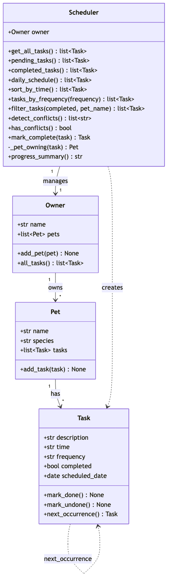

# PawPal+ (Module 2 Project)

You are building **PawPal+**, a Streamlit app that helps a pet owner plan care tasks for their pet.

## Scenario

A busy pet owner needs help staying consistent with pet care. They want an assistant that can:

- Track pet care tasks (walks, feeding, meds, enrichment, grooming, etc.)
- Consider constraints (time available, priority, owner preferences)
- Produce a daily plan and explain why it chose that plan

Your job is to design the system first (UML), then implement the logic in Python, then connect it to the Streamlit UI.

## What you will build

Your final app should:

- Let a user enter basic owner + pet info
- Let a user add/edit tasks (duration + priority at minimum)
- Generate a daily schedule/plan based on constraints and priorities
- Display the plan clearly (and ideally explain the reasoning)
- Include tests for the most important scheduling behaviors

## Getting started

### Setup

```bash
python -m venv .venv
source .venv/bin/activate  # Windows: .venv\Scripts\activate
pip install -r requirements.txt
```

### Suggested workflow

1. Read the scenario carefully and identify requirements and edge cases.
2. Draft a UML diagram (classes, attributes, methods, relationships).
3. Convert UML into Python class stubs (no logic yet).
4. Implement scheduling logic in small increments.
5. Add tests to verify key behaviors.
6. Connect your logic to the Streamlit UI in `app.py`.
7. Refine UML so it matches what you actually built.

## 🖥️ Sample Output

Paste a sample of your app's CLI or Streamlit output here so a reader can see what a generated plan looks like:

```
# e.g.:
# Daily plan for Biscuit (Golden Retriever):
#   08:00 — Morning walk (30 min) [priority: high]
#   09:00 — Feeding (10 min) [priority: high]
#   ...
```
Today's Schedule
| Time  | Pet   | Task           | Frequency | Status     |
|-------|-------|----------------|-----------|------------|
| 07:30 | Snow  | Feed breakfast | daily     | completed |
| 18:00 | Snow  | Feed dinner    | daily     | ⬜ Pending |
| 18:00 | Cloud | Evening walk   | daily     | ⬜ Pending |


## 🧪 Testing PawPal+

```bash
# Run the full test suite:
pytest

# Run with coverage:
pytest --cov
```

Sample test output:

```
# Paste your pytest output here
```
====================================== test session starts =======================================
platform darwin -- Python 3.11.5, pytest-9.1.1, pluggy-1.6.0
rootdir: /Users/_rifahtasfia/ai110-module2show-pawpal-starter
plugins: anyio-4.14.0
collected 12 items                                                                               

test_pawpal_system.py ............                                                         [100%]

======================================= 12 passed in 0.01s =======================================

## Features

- **Sorting by time** — `Scheduler.sort_by_time()` orders every task chronologically using `sorted()` with a `key` lambda on each task's `HH:MM` time. Returns a new list, so the pets' own task lists are never mutated.
- **Filtering** — `Scheduler.filter_tasks(completed, pet_name)` returns tasks matching an optional completion status and/or pet name (case-insensitive), combined with AND, in a single O(n) pass.
- **Conflict warnings** — `Scheduler.detect_conflicts()` buckets pending tasks by their `(date, time)` slot in one O(n) pass and returns a warning message for any slot holding more than one task — whether the clash is within one pet or across pets. `has_conflicts()` gives a quick boolean.
- **Daily / weekly recurrence** — `Task.next_occurrence()` uses `timedelta` (+1 day for daily, +7 days for weekly) to build a fresh, uncompleted copy on the next date; `timedelta` handles month, year, and leap-day rollovers automatically. `Scheduler.mark_complete()` marks a task done and auto-queues that next occurrence for the same pet. One-off tasks produce no follow-up.
- **Progress summary** — `Scheduler.progress_summary()` reports how many tasks are completed vs. the total.

### Feature-to-method map

| Feature | Method(s) | Notes |
|---------|-----------|-------|
| Sorting by time | `sort_by_time()` | `sorted()` + `key` lambda on zero-padded `HH:MM`; non-mutating |
| Filtering | `filter_tasks(completed, pet_name)` | Optional filters combined with AND; case-insensitive pet name |
| Conflict warnings | `detect_conflicts()`, `has_conflicts()` | O(n) bucket by `(date, time)`; flags same-pet and cross-pet overlaps |
| Daily / weekly recurrence | `Task.next_occurrence()`, `mark_complete()` | `timedelta`-based next date; auto-queues the next instance |
| Progress summary | `progress_summary()` | Completed vs. total count |

## Class Diagram

The as-built class structure (source: [`diagrams/uml_final.mmd`](diagrams/uml_final.mmd)):



## Demo Walkthrough

### Main UI features

Launch the app with `streamlit run app.py`. The interface lets a pet owner:

- **Set the owner name** — a text field at the top; the owner and their pets persist across reruns via Streamlit session state.
- **Add a pet** — enter a name and pick a species (dog / cat / other); each pet shows a running count of its tasks.
- **Add a task** — choose which pet it belongs to, then enter a description, a time (`HH:MM`), and a frequency (daily / weekly).
- **View today's schedule** — a sorted table of tasks with columns for **Time, Pet, Task, Frequency, and Status**.
- **Filter the schedule** — a "Filter by pet" dropdown and a "Show: All / Pending / Completed" toggle narrow the table live.
- **Mark a task done** — pick a pending task and complete it; recurring tasks automatically regenerate for their next date.

### Example workflow

1. Type an owner name (e.g. *Rifah*).
2. **Add a pet** — "Snow", species *cat*. Add a second pet, "Cloud", species *dog*.
3. **Add tasks** — give Snow a *daily* "Feed breakfast" at `07:30` and a "Feed dinner" at `18:00`; give Cloud a *daily* "Evening walk" at `18:00`.
4. **View today's schedule** — the table appears sorted by time, so `07:30` comes before `18:00` regardless of the order you added tasks.
5. **Notice the conflict warning** — because Snow's dinner and Cloud's walk are both at `18:00`, a ⚠️ banner appears above the table.
6. **Filter** — switch "Filter by pet" to *Snow* to see only her tasks, or "Show → Pending" to hide completed ones.
7. **Mark a task done** — complete "Feed breakfast"; a success message confirms it and a note shows the next daily occurrence is scheduled for tomorrow.

### Key Scheduler behaviors shown

- **Sorting by time** (`sort_by_time()`) — the schedule table is always chronological, even when tasks are added out of order.
- **Filtering** (`filter_tasks()`) — the pet dropdown and status toggle filter the table by pet name and completion status.
- **Conflict warnings** (`detect_conflicts()`) — two tasks sharing a time slot (same pet or across pets) raise a ⚠️ warning instead of failing silently.
- **Daily / weekly recurrence** (`mark_complete()` → `Task.next_occurrence()`) — completing a recurring task auto-creates its next instance one day (daily) or one week (weekly) later.
- **Progress summary** (`progress_summary()`) — a caption reports how many tasks are done out of the total.

### Sample CLI output (`python main.py`)

`main.py` exercises the same Scheduler logic in the terminal. Tasks are added out of order to show the sorting, and two tasks are placed at `18:00` to trigger a conflict warning:

```text
Insertion order (as added):
  19:00  Evening play
  07:30  Feed breakfast
  18:00  Feed dinner
  08:00  Morning walk
  14:00  Vet visit
  18:00  Evening walk

Sorted by time (sort_by_time):
  07:30  Feed breakfast
  08:00  Morning walk
  14:00  Vet visit
  18:00  Feed dinner
  18:00  Evening walk
  19:00  Evening play

Snow's tasks (filter_tasks pet_name='Snow'):
  19:00  Evening play
  07:30  Feed breakfast
  18:00  Feed dinner

Completed tasks (filter_tasks completed=True):
  07:30  Feed breakfast
  08:00  Morning walk

Pending tasks (filter_tasks completed=False):
  19:00  Evening play
  18:00  Feed dinner
  14:00  Vet visit
  18:00  Evening walk


## Testing PawPal+
command: .venv/bin/pytest -v
====================================== test session starts =======================================
platform darwin -- Python 3.11.5, pytest-9.1.1, pluggy-1.6.0 -- /Users/_rifahtasfia/ai110-module2show-pawpal-starter/.venv/bin/python
cachedir: .pytest_cache
rootdir: /Users/_rifahtasfia/ai110-module2show-pawpal-starter
plugins: anyio-4.14.0
collected 12 items                                                                               

test_pawpal_system.py::test_sort_by_time_orders_chronologically PASSED                     [  8%]
test_pawpal_system.py::test_sort_by_time_does_not_mutate_original PASSED                   [ 16%]
test_pawpal_system.py::test_filter_tasks_by_pet_name_is_case_insensitive PASSED            [ 25%]
test_pawpal_system.py::test_filter_tasks_by_completion_status PASSED                       [ 33%]
test_pawpal_system.py::test_filter_tasks_no_filters_returns_everything PASSED              [ 41%]
test_pawpal_system.py::test_daily_task_next_occurrence_is_one_day_later PASSED             [ 50%]
test_pawpal_system.py::test_weekly_task_next_occurrence_is_one_week_later PASSED           [ 58%]
test_pawpal_system.py::test_one_off_task_has_no_next_occurrence PASSED                     [ 66%]
test_pawpal_system.py::test_mark_complete_auto_creates_next_recurring_instance PASSED      [ 75%]
test_pawpal_system.py::test_detect_conflicts_flags_cross_pet_overlap PASSED                [ 83%]
test_pawpal_system.py::test_no_conflicts_when_all_times_differ PASSED                      [ 91%]
test_pawpal_system.py::test_completed_task_does_not_count_as_conflict PASSED               [100%]

======================================= 12 passed in 0.01s =======================================

Brief Description: All 12 passed meaning the algorithmic features sorting, filtering, auto-recurrence, and conflict detection — all behave correctly, including their edge cases (case-insensitivity, non-mutation, one-off tasks, completed-task handling).